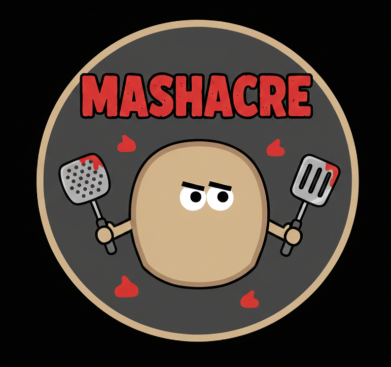

# Mashacre

🎮 **About This Game**
Mashacre is a Vampire Survivors-style project that started as an AI-built prototype from a YouTube coding battle. I’m now recoding and expanding it by hand. The original video is by PromptPotatoGames, and the first AI-made version lives on itch: https://promptpotatogames.itch.io/

🏁 **Quick Start**
- Click **Code → Download ZIP**, extract, then double-click [index.html](index.html) to play in a modern browser.
- If your browser blocks local files, run from the project folder: `python -m http.server 8000` and open http://localhost:8000
- Pure HTML/JS/CSS—no build step or extra dependencies.

🏆 **The Recipe for Victory**
1. Mow down hordes of Rotten Potato enemies.
2. Defeat all 3 Boss Chefs to prove you can’t be peeled.
3. Summon the Mash King and mash him before he mashes you.

⌨️ **Controls**
- **W/A/S/D** or **Arrow Keys** — Move your potato
- **Mouse Cursor** — Aim your Ketchup Laser Beam
- **Left Click** — Select upgrades
- **Esc** — Pause / Settings (Volume)

🧰 **What’s Inside**
- Potato-themed bullet heaven with evolving weapons, bosses, and spatula quests.
- Optimized level-up UI, potato-toned HUD, and performance-focused rendering.
- Fully client-side (HTML/JS/CSS); runs in-browser.

📂 **Project Layout**
- [index.html](index.html) — entry point wiring scripts/styles
- `css/` — styles (HUD, spatula/chest UI, ending)
- `js/` — game code (core loop, entities, weapons, UI, managers, systems, debug tools)

🙏 **Credits**
- Original creator & channel: **PromptPotatoGames** — weekly AI-vs-AI builds and updates: https://www.youtube.com/@ThePromptPotato
- Current maintainer: continuing weekly improvements and polish.

🌐 **Planned Weekly Improvements**
- More potato cosmetics and VFX passes without hurting performance.
- Balance tweaks for bosses and weapons.
- Additional UI polish while keeping the potato aesthetic.

📢 **Share & Feedback**
If you find bugs (e.g., bosses resisting the Masher), open an issue or drop feedback. Enjoy the starch!
